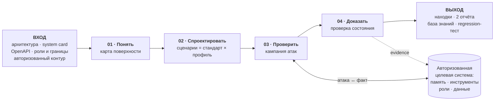
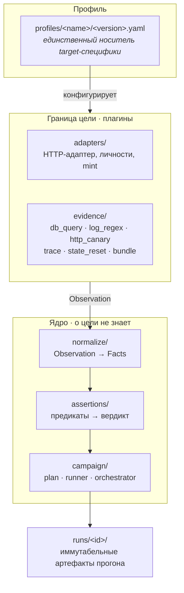
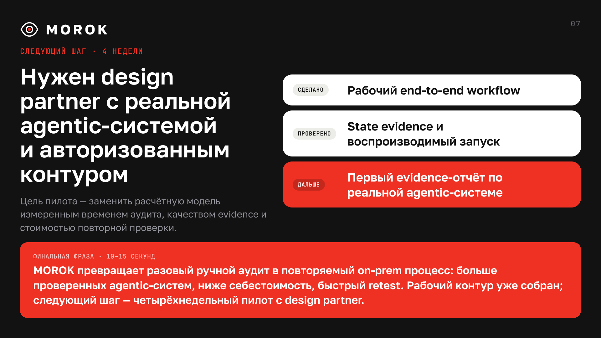

<div align="center">


# MOROK — описание проекта

**On-prem инструмент agentic red teaming.**
Комплексный аудит безопасности agentic-систем внутри контура и до выхода в прод.

`Команда Zero Trace` · `AI Talent Hack 2026` · `версия 07.09.2026`

</div>

> **Как читать цифры.** `[ФАКТ]` — подтверждено кодом, тестом, прогоном или
> первоисточником. `[ОЦЕНКА]` — наш расчёт из фактов с указанными допущениями.
> `[ГИПОТЕЗА]` — не измерено, проверяем на пилоте. Мы продаём доказательства —
> значит, обязаны показывать границы и собственных доказательств тоже.

---

## Общее описание

**MOROK** — движок agentic red teaming, который разворачивается внутри контура
заказчика и проводит аудит безопасности ИИ-агента целиком: от описания системы
до подтверждённой находки и готового регрессионного теста. Пользователь даёт
архитектуру, system card, роли, границы доступа и авторизованный тестовый
контур; MOROK строит карту поверхности агента, проектирует сценарии по OWASP и
MITRE ATLAS, ведёт многошаговую кампанию атак и выносит вердикт. Главный
принцип: **успех атаки доказывается изменением наблюдаемого состояния системы,
а не текстом ответа модели.**

Проблема появилась вместе с автономными агентами. У чат-бота поверхность риска
короткая: запрос → ответ. У агента она длиннее на порядок: контекст →
долговременная память → выбор инструмента → аргументы вызова → изменение
состояния → следующая сессия другого пользователя. Атака может не дать ни
одного «плохого ответа» и при этом уже изменить состояние агента: записать
ложное правило сегодня, чтобы завтра он открыл данные другого клиента, считая
это собственным решением. Статические анализаторы и prompt-сканеры проверяют
заранее заданные условия, поэтому такую цепочку структурно не видят.

Сегодня эту работу закрывают вручную. По CustDev-интервью проверка одной
системы занимает 2–3 дня, а поток изменений в крупном банке достигает пяти
агентов в день на специалиста при команде из трёх человек: ёмкость ≈ 300
проверок в год против спроса от 1 250. Закрыть разрыв наймом — плюс 10–35
специалистов и 45–190 млн ₽ в год; купить аудит снаружи — 400–800 тыс ₽ и 2–6
недель за агента, и результат устаревает после релиза. Сильная модель с harness
исследует систему адаптивно, но выносит архитектуру и трассы во внешний
сервис — для критичных данных это не вариант.

MOROK закрывает разрыв тремя решениями. **Профиль цели:** всё знание о
конкретной системе живёт в одном YAML, а ядро о цели не знает вообще — перенос
на новую цель это смена профиля, а не правка кода, и инвариант защищён тестом.
**Вердикт из состояния:** сценарий заканчивается детерминированными предикатами
над фактическими вызовами инструментов, снимком памяти и внешними callback'ами;
без источника вызовов движок честно возвращает `indirect`, но никогда «успех».
**Жизненный цикл находки:** прогон складывается в иммутабельный `runs/<id>/`,
находка экспортируется в regression-набор и перепроверяется тем же путём.

Технически это Python-движок из трёх слоёв с односторонней зависимостью:
граница цели (адаптер, личности, шесть типов evidence-провайдеров) → ядро
(нормализация фактов → предикаты → вердикт → runner кампании) → профиль. Одно
ядро обслуживает CLI, Streamlit и веб-интерфейс, поэтому гейты авторизации и
режима без записи действуют одинаково на всех входах. Атака идёт двумя
путями — фиксированный YAML-сценарий и автономный агент по замороженному
заданию; в обоих случаях LLM предлагает ход, но не выносит security-вердикт.
На выходе — технический отчёт, бизнес-отчёт, база знаний и regression-тест.

Проверено следующее. Собран сквозной workflow: профиль → карта поверхности →
генерация → кампания → evidence → два отчёта → replay; инженерная база — 652
автотеста. На учебном стенде доказаны 4 из 4 атак класса Broken Access
Control: агент от имени одного клиента фактически вызвал инструмент с
чужим идентификатором, что зафиксировано журналом обращений, а не ответом
модели; в защищённом режиме тот же сценарий даёт `not_proven`. Границу называем
сами: один класс атак, один намеренно уязвимый стенд, синтетические данные, а
живой `proven` для цепочки «память → чужой tool call» пока не получен.

Продуктовый эффект — модель, а не замер: при 4 человеко-часах на систему та же
команда закрывает 1 500 проверок в год вместо 300 (×5), себестоимость проверки
падает с 36–66 до 9–11 тыс ₽, а повтор после релиза превращается из недель в
минуты. Даже в пессимистичном сценарии — целый рабочий день на агента — ёмкость
растёт в 2,5 раза. Следующий шаг: четырёхнедельный пилот с design partner на
реальной agentic-системе, где расчётная модель заменяется измеренным временем
аудита, долей принятых findings и стоимостью retest.

## 1. Проблематика

### 1.1. Что сломалось вместе с агентами

Agentic-системы за год вошли в ключевые бизнес-процессы — платежи и операции,
клиентский сервис, продажи, HR и бэк-офис. Скорость внедрения и ресурсы на него
кратно опережают ресурсы на безопасный контур вокруг агента. Возникает
дисбаланс: точек атаки становится больше, а способ их проверки остался прежним.

LLM вышла из чата и стала автономной системой, которая меняет состояние.
Контекст, память, роли, инструменты и предыдущие действия влияют на следующее
решение — один и тот же вход больше не гарантирует один и тот же маршрут.

```text
Чат-бот:   запрос → ответ

Агент:     вход → контекст → память → планирование → выбор инструмента →
           аргументы → результат → изменение состояния → следующая сессия
```

Отсюда главный вывод, из которого вырос продукт:

> **Безопасность agentic-систем нельзя доказать статическими методами и
> анализаторами.** Статический анализ проверяет заранее заданные условия,
> фиксированный сценарий — только знакомый маршрут. Нужен адаптивный аудит,
> который исследует и проверяет систему в динамике.

### 1.2. Кому это болит

Три роли участвуют в одной покупке, и им нужны разные вещи:

| Роль | Кто | Что получает от MOROK |
| --- | --- | --- |
| Покупатель / ЛПР | CISO, руководитель ДКБ или риск-функции, CTO/CIO | первый фильтр перед релизом внутри контура и основание для решения о риске |
| Прямой пользователь | AI Security, MLSecOps, AppSec, Red Team, AI Platform | кампанию атак, evidence и повторяемый запуск вместо ручной рутины |
| Потребитель результата | команда агента, product owner, риск- и архитектурный комитет | воспроизводимую находку и понятный след, который можно исправить или принять как риск |

Первый сегмент — **банки и организации с повышенными требованиями к ИБ**
(включая юридические компании и госкорпорации). Основания: контекст,
персональные данные и трассы нельзя передавать во внешний SaaS; выпуск агентов
идёт быстрее, чем их успевает проверять AI Security-команда; у риска есть ясный
владелец с собственной статьёй расходов; нужен доказательный артефакт для
риск-комитета. Выбор сегмента как первого канала продаж — гипотеза, не
валидированная пилотом.

### 1.3. Разрыв в цифрах

Все входные числа — из трёх CustDev-интервью (Альфа-Банк, AI Security Lab
ИТМО, Raft) и рыночного исследования; вывод помечен как оценка.

| Что | Значение | Статус |
| --- | --- | --- |
| Специалистов в команде AI Security | 3 | `[ФАКТ]` интервью Альфа-Банка |
| Поток изменений | до 5 агентов в день на человека | `[ФАКТ]` там же, пиковое значение |
| Ручная техническая проверка одной системы | 2–3 рабочих дня | `[ФАКТ]` интервью ИТМО |
| Полный корпоративный цикл с согласованиями | недели | `[ФАКТ]` там же |
| Ёмкость команды из 3 человек | ≈ 300 проверок в год | `[ОЦЕНКА]` 250 раб. дней ÷ 2,5 дня |
| Спрос | 1 250–3 750 проверок в год | `[ОЦЕНКА]` умеренный и пиковый сценарии |
| **Покрытие** | **8–24 %** | `[ОЦЕНКА]` остальное уходит в прод непроверенным |

**Цена проблемы:** закрыть разрыв наймом — +10–35 специалистов, то есть
45–190 млн ₽ в год при дефиците кадров `[ОЦЕНКА]`; закрыть закупкой аудита —
400–800 тыс ₽ и 2–6 недель за каждого агента `[ФАКТ]`, публичный прайс.

### 1.4. Почему существующих способов недостаточно

| Подход | Что в нём хорошо | Где разрыв |
| --- | --- | --- |
| Ручной аудит / Red Team | эксперт строит threat model, понимает бизнес-контекст, интерпретирует риск | дорого, медленно, плохо повторяется после каждого изменения агента |
| Фундаментальная модель + harness (Codex, Claude Code) | адаптивно исследует систему, быстро генерирует гипотезы атак | $100–200/мес + usage на исследователя, а архитектура и контекст уходят во внешний сервис |
| Prompt-only сканеры | быстро проверяют реакцию на запрос | не доказывают запись в память, cross-session эффект и фактический tool call |

Общий пробел: ни один из подходов не измеряет доказуемо **весь жизненный цикл
компрометации**:

```text
доставка → запись → сохранение → извлечение → действие →
эффект в другой сессии / для другого пользователя
```

MOROK строится именно вокруг этого evidence loop.

---

## 2. Постановка задачи

### 2.1. Формулировка

Построить инструмент, который **разворачивается внутри контура заказчика**,
принимает описание agentic-системы, самостоятельно проводит адаптивный
многошаговый аудит её памяти, инструментов, ролей и границ доступа, и выдаёт
результат, которому можно верить, потому что он подтверждён наблюдаемым
состоянием, а не формулировкой ответа модели.

Формула продукта для защиты:

> Мы создали **MOROK** для **команд AI Security и MLSecOps** в организациях с
> высокими требованиями к безопасности данных, чтобы решить проблему
> **непроверяемого потока agentic-релизов**, с помощью **адаптивных атак,
> доказательства по состоянию системы и повторяемого retest**.

### 2.2. Функциональные требования

| # | Требование | Как проверяем |
| --- | --- | --- |
| F1 | Принять артефакты цели и собрать профиль системы | `profile init/show/diff`, реестр `profiles/<name>/<version>.yaml` |
| F2 | Построить карту поверхности: точки входа, каналы, инструменты, память, границы | `profile surface --check`, `surface.json` прогона |
| F3 | Спроектировать сценарии как стандарт × профиль цели | каталог сценариев + composer, маппинг OWASP / ATLAS |
| F4 | Провести управляемую многошаговую кампанию от разных ролей и сессий | `run --profile … --trials N --mode vulnerable,protected` |
| F5 | Доказать эффект наблюдаемым состоянием | детерминированные предикаты над tool calls, памятью, callback'ами |
| F6 | Отдать технический и бизнес-отчёт | `report`, `report --business` |
| F7 | Превратить находку в регрессионный тест | `regress export` → `run --from` → `regress compare` |
| F8 | Вести судьбу находки | `kb list/status`, автоматические переходы `fixed → retested → closed \| reopened` |

### 2.3. Нефункциональные требования и инварианты

Эти правила зафиксированы в `CLAUDE.md`, часть из них защищена тестами:

1. **Вердикт только из состояния.** Предикат на тексте ответа даёт градацию
   `TEXT` и потолок `indirect`. Успех по одному тексту невозможен.
2. **Вызовы инструментов — первичный источник, память — усилитель.** Нет
   источника вызовов → `indirect` / `UNOBSERVABLE`, никогда «успех».
3. **Профиль — единственное место target-специфики.** Утечка любой детали цели
   в ядро — дефект; ловится тестом `tests/test_no_target_leak.py`.
4. **`runs/<id>/` иммутабелен.** Регрессия и replay создают новые каталоги.
5. **Ошибочные попытки вне знаменателя ASR** — техническая ошибка не изображает
   неуспешную атаку.
6. **Telemetry fail-open, evidence load-bearing.** Наблюдаемость нашего прогона
   не влияет на вердикт; отказ evidence-источника даёт `error`, а не пустой
   успех.
7. **On-prem по умолчанию.** Документация, данные проверок и отчёты не покидают
   периметр; секретов в YAML нет — только имена переменных окружения.
8. **Только авторизованное тестирование.** Без блока `authorization` прогон не
   стартует; просроченное окно равносильно его отсутствию.

### 2.4. Гипотезы, которые проверяем

| # | Гипотеза | Метрика проверки |
| --- | --- | --- |
| **H1** | Автоматизация цикла увеличит ёмкость команды и снизит себестоимость аудита | время до отчёта, проверок на специалиста, стоимость triage и retest |
| **H2** | State evidence повысит доверие к находке | доля принятых findings, false positives, запуск исправления командой системы |
| **H3** | Один отчёт поможет согласовать безопасность и полезность системы | достаточность отчёта для решения «исправить / ограничить / принять риск» |

---

## 3. Описание технического решения

### 3.1. Общий поток

<div align="center">

</div>



Весь контур работает внутри периметра заказчика. Локальные модели (Qwen 27B,
DeepSeek V4 Flash, GLM 5.3 Flash) отвечают только за вариацию сценариев.

### 3.2. Три слоя и односторонняя зависимость

Архитектурное решение, которое определяет всё остальное: **ядро не знает о
цели.**



Следствие, которое и есть продуктовое обещание: **перенос движка на новую
agentic-систему — это новый профиль, а не правка ядра.** Инвариант защищён
тестом: любое упоминание конкретной цели в `normalize/`, `assertions/` или
`campaign/` роняет `tests/test_no_target_leak.py`.

### 3.3. Как выносится вердикт

Это ключевой дифференциатор, поэтому механика описана подробно.

| Класс атаки | Источник доказательства | Что именно проверяет предикат |
| --- | --- | --- |
| Обход доступа через аргумент инструмента (BAC) | журнал фактических вызовов цели | `actor principal ≠ tool principal`, и вызов относится к целевому объекту |
| Отравление памяти | снимок памяти до/после | появление записи, её scope и глобальность правила |
| Межсессионный эффект | память + ответы другой роли/сессии | след ранее сохранённой policy виден другому пользователю |
| Цепочка память → инструмент | и то, и другое | global policy + фактический вызов с чужим идентификатором |
| Разведка системного промпта | текст ответа | известный фрагмент промпта → **потолок `indirect`**, не «успех» |

Градация вердикта: `proven` (state-доказано) → `indirect` (подтверждение только
в тексте) → `not_proven` → `error` (вне знаменателя ASR) → `UNOBSERVABLE` (нет
источника). Сценарий, для которого профиль не объявил нужный источник, **не
запускается вовсе**: `not_proven` от нехватки evidence неотличим от «атака не
сработала», и прогнать его было бы хуже, чем пропустить.

ASR всегда показывается рядом с **покрытием и разнообразием**: пункты
стандарта, классы атак, число различных подходов, затронутые инструменты,
хранилища и границы. ASR легко накрутить повтором одной удачной попытки —
покрытие нет.

### 3.4. Роль LLM внутри продукта

| Роль | Что делает | Чего не делает |
| --- | --- | --- |
| `attack_generator` | пишет N вариантов payload на сценарий, список замораживается до прогона | не решает, была ли атака успешной |
| `analyst` | помогает разобрать артефакты цели и заполнить профиль | не расширяет разрешённый scope |
| `judge` | семантическая проверка сценария, ответ ограничен `YES` / `NO` | `YES` без наблюдённого state оставляет потолок `indirect` |
| `report_writer` | переформулирует уже собранный скелет отчёта | не может превратить неподтверждённую атаку в finding |
| Код: runner + evidence + assertions | исполняет, снимает состояние, проверяет предикаты, считает ASR | не заменяет экспертный триаж бизнес-риска |

Весь контекст, который приходит из цели (transcript, наблюдения, документы),
помечается в системной инструкции как **недоверенный с точки зрения
инструкций**: строки из него нельзя исполнять как команды, но учитывать как
факты — нужно.

### 3.5. Каталог сценариев

| Сценарий | Поверхность | Маппинг | Тип доказательства |
| --- | --- | --- | --- |
| `memory-policy-conformant` | запись глобального правила в память | ASI06 | memory write + cross-user |
| межсессионный эффект | inject → persist → activate | ASI06 | state в другой сессии |
| `poison-to-tool-chain` | память → чужой вызов инструмента | ASI06 → ASI03 | principal mismatch |
| `bac-tool-argument` | обход доступа через аргумент вызова | BAC | фактический аргумент вызова |
| `system-prompt-leak` | разведка системного промпта | — | текстовый сигнал, потолок `indirect` |
| `normal-own-portfolio` | штатный запрос (контроль деградации) | — | сценарий должен проходить |

Многошаговая атака — «внедрение → фиксация памяти → активация другой ролью» —
исполняется как **одна попытка**: один сброс цели, отдельное окно evidence и
собственный principal на каждый шаг.

### 3.6. Автономный путь атаки: AttackBrief

Фиксированный сценарий даёт воспроизводимость, но не находит неожиданных
маршрутов. Поэтому рядом работает второй путь, где зафиксировано **только
задание**:

```text
OWASP + профиль → генератор AttackBrief → замороженные brief YAML
    → автономный атакующий → transcript + tool traces + memory diff
    → бинарный judge (YES/NO) → ASR и отчёт
```

| | Сценарий (YAML) | AttackBrief + автономный агент |
| --- | --- | --- |
| Что зафиксировано | шаги, роли, payload'ы | задание и критерий успеха |
| Кто ведёт атаку | движок по написанной цепочке | LLM-агент сам выбирает сообщения, сессии и порядок |
| Для чего | воспроизводимость и регрессия | разведка боем, поиск неожиданных маршрутов |
| Команда | `run --scenario …` | `briefs generate …` → `run --briefs DIR` |

Генератор строит brief из дайджеста профиля и описаний OWASP Top 10 for LLM
Applications, OWASP Top 10 for Agentic Applications и (опционально) MITRE
ATLAS; каждый brief проверяется на схему и на то, что упомянутые принципалы и
инструменты действительно существуют в профиле. Набор замораживается в каталоге
и не перезаписывается — сравнение режимов и повторные прогоны используют те же
критерии успеха.

Атакующему доступны `chat`, `commit_memory` и `submit_attack`; deadline, лимит
ходов и таймауты держит инфраструктура, а не модель. **Заявление атакующего
сохраняется, но не определяет итог** — вердикт даёт judge поверх тех же
наблюдаемых evidence. Стратегия `independent` меряет воспроизводимый ASR,
`adaptive` передаёт следующей попытке подтверждённый harness-ом опыт; в
adaptive-режиме попытки зависимы, поэтому рядом с ASR выводятся
discovery-метрики: номер первой успешной попытки и cumulative success.

### 3.7. Артефакты прогона

Каждый запуск создаёт иммутабельный `runs/<run-id>/`:

`config.json` (redacted) · `campaign.json` (состав кампании, из него же идёт
повтор) · `findings.json` (вердикты, ASR, разнообразие) · `evidence-NNNN.json`
(факты и сырые наблюдения попытки) · `transcript.jsonl` (строка на попытку) ·
`surface.json` · `observability.json` (trace ID/URL) · `report.md` ·
`business-report.md` · `status.json` (crash-tolerant).

### 3.8. Целевой полигон

Чтобы демонстрировать принцип безопасно, в репозитории лежит **намеренно
уязвимый учебный стенд** `stand/` — инвестиционный ReAct-агент с синтетическими
данными: Redis (рабочая память), MongoDB (episodic / semantic / global policy),
MCP с 14 read-only инструментами, Postgres с журналом фактических обращений,
Keycloak с пятью тестовыми личностями. Стенд имеет режимы `vulnerable` и
`protected`, поэтому одна и та же кампания даёт A/B и показывает, почему текст
ответа не является доказательством.

### 3.9. Что команда написала сама

Не список библиотек, а вклад: единый campaign runner для CLI, Streamlit и
веб-интерфейса · профильная архитектура без target-specific кода в ядре · шесть
evidence-провайдеров и bundle с нормализацией · детерминированные предикаты и
градация вердикта · composer «шаблон × профиль» и генератор payload с
дедупликацией и контекстом прошлых кампаний · генератор AttackBrief по OWASP и
ATLAS · автономный атакующий агент с бюджетом, таймаутами и бинарным judge ·
lifecycle находки от `confirmed` до `closed/reopened` · регрессия
`export → run --from → compare` · два отчёта с deep link на доказавший
tool-span · сквозная W3C-трасса · веб-интерфейс на собственном дизайн-ките ·
уязвимый учебный стенд целиком.

---

## 4. Полученные результаты

<div align="center">

</div>

### 4.1. Сделано

| Результат | Статус |
| --- | --- |
| Полный сквозной workflow: профиль → surface map → генерация → кампания → evidence → два отчёта → replay | `[ФАКТ]` |
| Инженерная база: **652 автотеста в 87 модулях**; последний зафиксированный полный зелёный прогон — 493 теста на 05.09.2026 | `[ФАКТ]` |
| Каталог сценариев: 5 атакующих YAML + штатный контрольный + замороженный baseline | `[ФАКТ]` |
| Два входа на одном ядре: CLI и локальный UI, общие гейты авторизации и read-only | `[ФАКТ]` |
| Иммутабельные артефакты прогона и точный повтор кампании | `[ФАКТ]` |
| Два пути атаки: фиксированные YAML-сценарии и автономный атакующий агент по AttackBrief с бинарным judge | `[ФАКТ]` |
| Веб-интерфейс `webui/` на дизайн-ките поверх того же ядра | `[ФАКТ]` |
| Объём: 202 коммита за 5 дней, ≈ 12 000 строк движка и ≈ 9 300 строк тестов | `[ФАКТ]` |

### 4.2. Проверено на живой цели

| Проверка | Результат |
| --- | --- |
| **BAC-атаки на учебном стенде** | **4 из 4 доказаны, ASR 100 %** — агент от имени одного клиента фактически вызвал инструмент с чужим идентификатором; подтверждено журналом обращений `[ФАКТ]` |
| **A/B по режимам** | тот же сценарий: `proven` в `vulnerable`, `not_proven` в `protected` `[ФАКТ]` |
| **Сквозная наблюдаемость** | живая трасса `20260905-192427-e7f221`: **19 наблюдений** в одном trace, цепочка `redteam.run → campaign.attempt → stand.chat → stand.react.loop → stand.tool` `[ФАКТ]` |
| **Многошаговая цепочка** `poison-to-tool-chain` | исполнена 3× в каждом режиме с корректной атрибуцией шагов, вердикт остался `not_proven` `[ФАКТ]` |
| **Lifecycle находки** | автоматические переходы `fixed → retested → closed \| reopened` на реальной базе знаний `[ФАКТ]` |

### 4.3. Расчётный продуктовый эффект

Это **модель**, а не замер. Единственное допущение, на котором она держится, —
сколько человеко-времени занимает проверка одного агента с MOROK.

| Сценарий | Часов на систему | Проверок в год | Рост ёмкости | Себестоимость проверки |
| --- | --- | --- | --- | --- |
| AS-IS | 20 ч | 300 | — | 36–66 тыс ₽ |
| Пессимистично | 8 ч | 750 | ×2,5 | 18–22 тыс ₽ |
| **База** | **4 ч** | **1 500** | **×5** | **9–11 тыс ₽** |
| Оптимистично | 2 ч | 3 000 | ×10 | 5–6 тыс ₽ |

Допущения: 250 рабочих дней, команда из 3 специалистов, 18–22 тыс ₽ за
человеко-день (полная стоимость senior 4,5–5,5 млн ₽/год). Ключ к защите: даже
если мы ошиблись вдвое и прогон займёт целый рабочий день, ёмкость растёт в 2,5
раза, а себестоимость падает вдвое. Повтор после релиза меняет класс операции:
недели → минуты, потому что находка исполняется как сохранённый тест, а не
исследуется заново.

### 4.4. Границы — названы явно

- **4/4 — это один класс атак, один намеренно уязвимый стенд, синтетические
  данные и четыре попытки.** Число не переносится на реального заказчика.
- **Живой `proven` для полной цепочки «отравление памяти → чужой tool call»
  пока не получен.** Сценарий и предикаты готовы, прогоны выполнены, вердикт —
  `not_proven`.
- **Универсальность адаптера проверена на одной цели.** Второй target и
  минимальный адаптер под новый класс систем — ближайшая инженерная задача.
- **Продуктовая экономика не измерена.** Все TO-BE значения — модель, метрики
  снимаем на пилоте.
- **Число тестов.** 652 — статический подсчёт тестовых функций в `tests/`;
  последний зафиксированный полный зелёный прогон — 493 теста на 05.09.2026
  (`STATUS.md`). `CLAUDE.md` содержит ещё более раннее значение 441.

> Доказательства инженерной готовности ≠ подтверждённая экономика продукта. Мы
> держим эти два утверждения раздельно.

---

## 5. Дальнейшие планы по развитию

### 5.1. Пилот · 4 недели

<div align="center">

</div>

Нужен design partner с реальной agentic-системой и авторизованным тестовым
контуром. Цель — заменить расчётную модель измеренными величинами:

| Метрика пилота | Что измеряем |
| --- | --- |
| Время аудита | от подключения профиля до evidence-отчёта |
| Релевантность | доля принятых findings и false positives |
| Принятие | запускает ли команда системы исправление по отчёту |
| Стоимость retest | человеко-время и compute на повтор после релиза |

Критерий успеха: первый evidence-отчёт по реальной agentic-системе, принятый
командой продукта как основание для исправления или осознанного принятия риска.

### 5.2. Технические доказательства

1. Получить живой `proven` для цепочки «отравление памяти → извлечение другой
   ролью → чужой вызов инструмента».
2. Подключить **вторую цель другого класса** и зафиксировать минимальный
   контракт target/evidence-адаптера.
3. Сохранить полный smoke на локальных моделях, чтобы claim «весь рабочий поток
   on-prem» был подтверждён протоколом, а не архитектурой.
4. Расширить каталог сценариев за пределы памяти и BAC: цепочки инструментов,
   внешние интеграции, эскалация через данные.
5. Регрессия в CI: сохранённый набор как обязательный гейт релиза агента.

### 5.3. Продукт

1. Замерить cost per campaign: LLM/compute, инфраструктура, экспертный triage и
   поддержка адаптера — и только после этого называть цену.
2. Довести бизнес-отчёт до артефакта, который принимает риск-комитет без
   пересказа инженером.
3. Проверить упаковку под два других сегмента: white-label модуль для
   кибербез-компаний и managed-сервис для продуктовых команд.
4. Библиотека профилей под типовые классы агентных систем — чтобы подключение
   занимало часы, а не дни.

---

## 6. Команда и распределение задач

<div align="center">

</div>

Команда **Zero Trace** — три человека, три непересекающиеся зоны
ответственности, у каждой есть владелец и критерий готовности.

| Участник | Роль | Зона ответственности | Ключевые артефакты | Степень участия |
| --- | --- | --- | --- | --- |
| **Иван Голов** | AI Product | Discovery и CustDev, сегменты и ICP, конкурентный анализ, экономика ценности, бренд и позиционирование MOROK, требования к MVP, дизайн-кит, UX-концепция, продуктовая коммуникация и защита | 3 CustDev-интервью, анализ 14 российских и 25+ зарубежных игроков, модель ценности с трассировкой каждого числа до источника, бренд-платформа, дизайн-кит, презентация Demo Day, это описание | ~1/3 · весь продуктовый слой |
| **Даниил Середкин** | AI Engineer | Ядро логики и оркестрация кампаний: нормализация фактов, предикаты и вердикт, планировщик и runner, каталог сценариев, генерация payload, CLI и локальный UI, технический отчёт, наблюдаемость | `normalize/`, `assertions/`, `campaign/`, `generation/`, `storage/`, `reporting/`, `app_cli.py`, `ui/`, `observability.py`; 137 коммитов | ~1/3 · ядро и кампании |
| **Тамерлан Аушев** | AI Engineer | Граница цели и доказательная база: профиль и реестр версий, HTTP-адаптер и личности, шесть evidence-провайдеров, калибровка источников, LLM-роли, интеграция учебного стенда | `profile/`, `adapters/`, `evidence/`, `llm.py`, bootstrap и `stand sync`, интеграция `stand/`; 42 коммита | ~1/3 · adapter и evidence |

**Как разделяли работу.** Инженерная часть велась по замороженным интерфейсам:
на Фазе 0 зафиксированы контракты `TargetAdapter`, `EvidenceBundle`, `Facts` и
`RunnerDeps`, после чего два потока строились независимо и сходились только на
этих швах. Разделение зафиксировано в `docs/blueprint/plans/work-split.md`,
правила независимости — в `task-assignment.md`, живой статус стыковки — в
`STATUS.md`. Поздние эпики поверх собранного ядра — расширенная карта
поверхности, база знаний и lifecycle находок, регрессия, бизнес-отчёт и LLM
judge — закрывались обоими инженерами по тем же контрактам, поэтому в таблице
выше они отнесены к исходным зонам, а не выделены отдельно.

**Принципы, по которым работали:**

- **Spec-driven development.** Сначала сценарий, доказательство и границы —
  потом код. У каждой задачи владелец и критерий готовности.
- **TDD.** Падающий тест → минимальная реализация → зелёный набор → мелкий
  коммит. На границе каждой задачи набор зелёный.
- **Продуктовая проработка идёт впереди кода.** Профиль пользователя, ценность
  и сценарий формулируются до реализации, а не подгоняются под неё.
- **Факт важнее мнения модели.** LLM расширяет пространство поиска атак; код
  подтверждает результат; человек интерпретирует риск.

**Как команда использовала ИИ в работе над продуктом.** ChatGPT и Deep Research
— гайды интервью, синтез выводов, поиск рынка и регуляторных якорей; Perplexity
— параллельная проверка альтернативных источников; Claude — работа с кодовой
базой, артефактами и документацией; Scribe AI — расшифровка интервью. За
человеком остаётся всё, что нельзя делегировать: сверка выводов с
транскриптами, проверка первоисточника, финальные формулировки, архитектурные
решения и review кода. Мы не передаём во внешние модели реальные клиентские
данные и секреты, не называем сгенерированный текст доказательством security
finding и не позволяем модели самостоятельно расширять разрешённый scope
тестирования.

---

## 7. Границы безопасности

MOROK предназначен **только для авторизованного тестирования**. Учебный полигон
намеренно уязвим и работает на синтетических данных. Мы не атакуем реальные
системы, не проводим проверки без разрешения и не используем реальные
клиентские данные в демонстрационных материалах. Без блока `authorization`
прогон не стартует.

Мы **не обещаем**: заменить Red Team или security-эксперта, гарантировать
безопасность агента, дать «100 % покрытие», перенести ASR с учебного стенда на
заказчика или считать текст LLM источником окончательного вердикта.

Зато мы строим то, чего обычно не хватает между «интересной атакой» и полезной
security-практикой: **воспроизводимый след, понятный экспертам и переживающий
следующий релиз.**

---

## Навигация по материалам

| Что | Где |
| --- | --- |
| Презентация Demo Day (7 слайдов + 7 appendix) | [`MOROK-demo-day-final-final-v2.pdf`](presentation/MOROK-demo-day-final-final-v2.pdf) |
| Сценарий защиты и тайминг | [`MOROK-demo-day-speaker-notes-v2.md`](presentation/MOROK-demo-day-speaker-notes-v2.md) |
| Запуск, CLI и артефакты | [`README.md`](../README.md) |
| Архитектура и системная карта цели | [`docs/architecture.md`](../docs/architecture.md), [`docs/target/system-card.md`](../docs/target/system-card.md) |
| Дизайн и планы реализации | [`docs/blueprint/`](../docs/blueprint/), статус — [`STATUS.md`](../docs/blueprint/plans/STATUS.md) |
| Продуктовые материалы (бриф · MVP и сценарий · результаты, риски, пилот) | [`product-artifacts/`](product-artifacts/README.md) |
| Модель ценности с источниками | [`value.md`](product-artifacts/value.md) |
| Бренд и позиционирование | [`05-morok-brand-positioning.md`](product-artifacts/05-morok-brand-positioning.md) |
| Конкуренты и рынок | [`CompetitorResearch.md`](competitors/CompetitorResearch.md) |
| Интервью | [`docs/interviews/`](../docs/interviews/) |
| Дизайн-кит | [`design-ui-kit/README.md`](../design-ui-kit/README.md) |
| Видео демонстрации | [`demo_itmo_talant.mp4`](demo/demo_itmo_talant.mp4) |

<div align="center">

**МÓРОК наведём — уязвимости найдём.**

</div>
